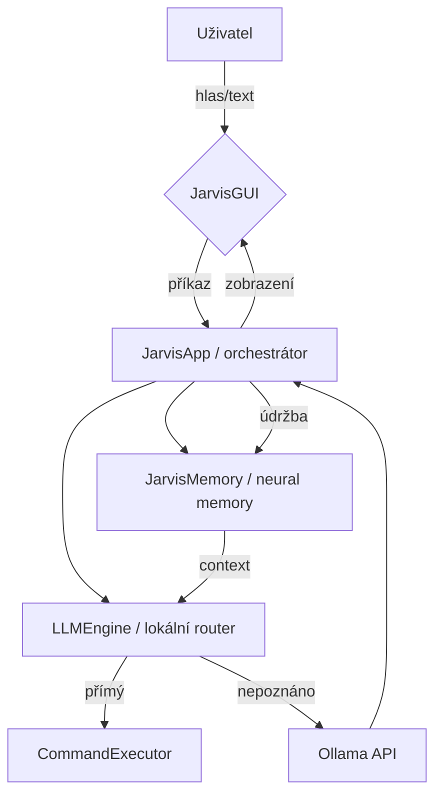

# JARVIS v2.0 — Hlasový asistent

Lokální AI asistent poháněný Ollama. Ovládá PC hlasem nebo textem, mluví kvalitním českým hlasem.

**Verze:** 2.0

## Rychlý start

### Linux
```bash
chmod +x install.sh && ./install.sh
source jarvis-env/bin/activate
ollama serve &
python jarvis.py
```

### Windows
```
install.bat
ollama serve
python jarvis.py
```

### Jako aplikace (Linux — ikona na ploše)
```bash
# Zkopíruj start-jarvis.sh do ~/.local/bin/
cp start_jarvis.sh ~/.local/bin/start-jarvis.sh
chmod +x ~/.local/bin/start-jarvis.sh

# Vytvoř .desktop soubor
cp jarvis.desktop ~/.local/share/applications/
cp jarvis.desktop ~/Plocha/   # nebo ~/Desktop/
```

## Co umí

### Systém
| Příkaz | Akce |
|---|---|
| „Vypni počítač" | Shutdown |
| „Restartuj" | Restart |
| „Uspi počítač" | Suspend |
| „Info o systému" | CPU, RAM, disk |
| „Ukonči chrome" | Kill process |
| „Aktualizuj systém" | apt upgrade |

### Soubory
| Příkaz | Akce |
|---|---|
| „Vytvoř složku kytara v Dokumentech" | mkdir |
| „Vytvoř složku kytara a otevři ve vscode" | mkdir + VSCode |
| „Smaž soubor test.txt" | přesun do koše |
| „Přesuň soubor X do Y" | mv |
| „Najdi soubor readme" | find |
| „Otevři složku X ve vscode" | code /cesta |

### Aplikace & web
| Příkaz | Akce |
|---|---|
| „Otevři Chrome" | Spustí aplikaci |
| „Nainstaluj vlc" | apt install |
| „Odinstaluj vlc" | apt remove |
| „Hledej počasí Praha" | Google |
| „Počasí Praha" | wttr.in přímo |
| „Otevři github.com" | Browser |

### Zvuk & displej
| Příkaz | Akce |
|---|---|
| „Hlasitost na 60" | Nastaví hlasitost |
| „Ztlum" / „Odtlum" | Mute toggle |
| „Jas na 70" | Nastaví jas (brightnessctl) |
| „Zastav přehrávání" | Media klávesa |
| „Screenshot" | Uloží na plochu |

### Automatizace
| Příkaz | Akce |
|---|---|
| „Timer 5 minut" | Odpočet + notifikace |
| „Napiš hello world" | Napíše do aktivního okna |
| „Stiskni Ctrl+C" | Simuluje klávesu |
| „Zkopíruj Hello World" | Do schránky |
| „Nový soubor ve vscode" | Ctrl+N |

### Informace
| Příkaz | Akce |
|---|---|
| „Kolik je hodin?" | Čas |
| „Jaké je datum?" | Datum |
| „Jaký je jas CPU?" | System info |
| „Vypočítej 2+2*3" | Kalkulačka |
| „Přelož hello world" | Překlad (EN→CS) |
| „Přidej poznámku nakoupit chleba" | Uložení poznámky |
| „Zobraz poznámky" | Zobrazení poznámek |
| „Připomeň mi zavolat mamce" | Nastavení připomínky |
| „Co je Python?" | Hledání na Wikipedii |
| „Převeď 100 USD na CZK" | Převod měny |
| „Zapamatuj si uživatel má rád kávu" | Uložení do neural memory |
| „Co si pamatuješ o uživateli?" | Vyhledávání v paměti |
| „Statistiky paměti" | Info o neural memory |
| Obecné otázky | Ollama AI odpověď s kontextem z paměti |

## Konfigurace (`config.json`)

Model `ollama_model` lze upravit přímo v uživatelském rozhraní pomocí výběru v horní části okna, konfigurace se uloží automaticky do `config.json`.

```json
{
  "ollama_url":   "http://localhost:11434/api/chat",
  "ollama_model": "llama3.1:8b",
  "tts_enabled":  true,
  "tts_voice":    "cs-CZ-AntoninNeural",
  "history_size": 20,
  "window_size":  "600x820"
}
```

## Deployment

### Docker (nejjednodušší)
```bash
# Sestav a spusť
docker-compose up --build

# Nebo jen JARVIS (pokud Ollama běží lokálně)
docker build -t jarvis .
docker run --rm -it --network host jarvis
```

### Systemd service (Linux autostart)
```bash
# Zkopíruj service soubor
sudo cp jarvis.service /etc/systemd/system/

# Povol a spusť
sudo systemctl enable jarvis
sudo systemctl start jarvis

# Status
sudo systemctl status jarvis
```

### Windows service
Použij NSSM nebo Windows Task Scheduler pro autostart.

## Troubleshooting

### Ollama se nespustí
```bash
# Zkontroluj port
curl http://localhost:11434/api/tags

# Spusť manuálně
ollama serve

# Stáhni model
ollama pull llama3.1:8b
```

### TTS nefunguje
```bash
# Nainstaluj audio přehrávač
sudo apt install mpg123 ffmpeg

# Test edge-tts
python -c "import edge_tts; print('OK')"
```

### Mikrofon nefunguje
```bash
# Zkontroluj práva
sudo usermod -a -G audio $USER

# Test SpeechRecognition
python -c "import speech_recognition as sr; print(sr.Microphone.list_microphone_names())"
```

## Vývoj

### Spuštění testů
```bash
source venv/bin/activate
python test_jarvis.py
```

### Přidání nové akce
1. Přidej do `SYSTEM_PROMPT` v `jarvis.py`
2. Implementuj v `execute_action()`
3. Přidej unit test

## Licence

MIT License - volně šiřitelný a upravitelný.

**Dostupné české hlasy (edge-tts):**
- `cs-CZ-AntoninNeural` — muž (výchozí)
- `cs-CZ-VlastaNeural` — žena

**Modely Ollama:** `llama3.1:8b` (výchozí), `mistral:7b`, `llama3.2:3b` (rychlejší)

## Neural AI Memory System

JARVIS používá pokročilý brain-inspired memory systém z [neural-ai-memory](https://github.com/Reezxy/Neural-AI-Memory-system):

### Funkce paměti:
- **Dynamické ukládání:** Automatické ukládání konverzací s hodnocením důležitosti
- **Inteligentní vyhledávání:** Sémantické vyhledávání s ohodnocením relevance, důležitosti a časovosti
- **Automatická údržba:** Decay neaktivních vzpomínek, merge podobných, abstrakce konceptů
- **Kontext pro AI:** Poskytuje relevantní kontext pro lepší odpovědi

### Příkazy pro paměť:
- `"Zapamatuj si [informace]"` - Uloží do dlouhodobé paměti
- `"Co si pamatuješ o [téma]?"` - Vyhledá relevantní vzpomínky
- `"Statistiky paměti"` - Zobrazí počet uložených vzpomínek
- `"Údržba paměti"` - Spustí optimalizaci paměti

Paměť se ukládá lokálně v `memory_data/` a přežívá restarty JARVIS.

## Závislosti

```
pip install -r requirements.txt
```

| Balíček | Účel |
|---|---|
| `customtkinter` | GUI |
| `requests` | Ollama API + počasí |
| `edge-tts` | Kvalitní český TTS hlas |
| `pyautogui` | Ovládání klávesnice/myši |
| `psutil` | Systémové info a procesy |
| `pyperclip` | Schránka (české znaky) |
| `SpeechRecognition` + `PyAudio` | Mikrofon (volitelné) |
| `pycaw` + `comtypes` | Přesná hlasitost Windows (volitelné) |

## Požadavky

- Python 3.11+ (doporučeno)
- [Ollama](https://ollama.com) — `ollama serve`
- Model — `ollama pull llama3.1:8b`
- ffplay (Linux TTS) — `sudo apt install ffmpeg`
- brightnessctl (jas) — `sudo apt install brightnessctl`

## Logování

Aplikace zapisuje logy do souboru `jarvis.log` v kořenovém adresáři projektu.

## Architektura

JARVIS je rozdělen do modulárních vrstev, aby se oddělila logika orchestrace, GUI, systémové akce, LLM a paměť.



### Moduly
- `jarvis.py` — minimalistický bootstrap, který spouští `JarvisApp`
- `app_core.py` — hlavní orchestrátor, event loop, error handling a bezpečnostní kontrola
- `gui.py` — desktopové UI, ovládací prvky, animovaný orb a chat
- `commands.py` — konkrétní systémové akce (otevření aplikací, soubory, zvuk, systém)
- `llm.py` — lokální router + Ollama integrace, odpovědi, streamování a paměťový kontext
- `memory.py` — neural memory wrapper s ukládáním, recall kontextem a údržbou
- `security.py` — whitelist a potvrzovací logika pro nebezpečné akce
- `logging_setup.py` — samostatná konfigurace logování

## Datové toky
1. Uživatel mluví nebo píše do GUI.
2. `JarvisApp` přijme text a nejdříve zkusí lokální router v `LLMEngine`.
3. Pokud router nalezne akci, ta se provede lokálně.
4. Pokud se akce nerozpozná, dotaz jde na Ollama a výstup se zobrazí uživateli.
5. Relevantní výsledky i konverzace se ukládají do `JarvisMemory`.
6. Při dalších dotazech se do promptu přidává kontext z paměti.

## Memory pipeline
Paměť `JarvisMemory` využívá `neural-ai-memory` jako brain-inspired vrstvu:
- `store()` ukládá obsah s důležitostí, tagy a metadata
- `recall()` vyhledává semanticky relevantní vzpomínky
- `recall_context()` sestavuje kontext pro aktuální dotaz
- `run_maintenance()` spouští decay, merge a abstrakci
- `stats()` vrací agregovaná data

### Jak funguje paměť
- Relevance se hodnotí vážením sémantické podobnosti, důležitosti a recency.
- `decay_rate` postupně snižuje skóre starých záznamů.
- `merge_similarity_threshold` slouží k automatickému spojování podobných vzpomínek.
- Koncepty mohou být abstrahovány do širších shrnutí.

## Bezpečnostní vrstva
JARVIS nyní používá whitelist akcí a potvrzovací logiku pro rizikové operace.

- **Whitelist:** pouze explicitně definované akce se mohou vykonat.
- **Potvrzení:** `delete_file`, `shutdown`, `restart`, `install_app`, `uninstall_app`, `run_script`, `kill_process` a podobné akce vyžadují uživatelské potvrzení.
- **Sandbox režim:** nebezpečné akce je možné blokovat bez změny zbytku systému.

## Nastavení (Settings)

JARVIS nyní poskytuje interaktivní panel s nastavením přístupný přes tlačítko **⚙** v levém panelu GUI.

### Nastavitelné parametry

#### 1. Jazyk rozpoznávání řeči (STT)
- **Výběr z 10 jazyků:** Čeština, Angličtina, Španělština, Francouzština, Němčina, Italština, Portugalština, Polština, Ruština
- **Změna bez restartování:** Nový jazyk se aplikuje okamžitě
- **Google STT API:** Podporuje všechny jazyky
- **Offline fallback:** Pouze pro češtinu (Sphinx)

#### 2. Citlivost mikrofonu (Energetický práh)
- **Rozsah:** 100–4000 (nižší = citlivější)
- **Výchozí:** 300
- **Dopad:** Kontroluje, jak tichý zvuk se musí detekovat jako řeč
- **Užitečné pro:** hlučná/tichá prostředí

#### 3. Rychlost TTS
- **Rozsah:** 100–250
- **Výchozí:** 170
- **Dopad:** Řídí, jak rychle mluví JARVIS
- **Užitečné pro:** sluchové potíže, různé preferencí

Všechna nastavení se automaticky ukládají do `config.json` a zůstávají zachována po restartu.

## Vývoj

### Spuštění testů
```bash
source venv/bin/activate
python -m unittest discover tests
```

### Přidání nové akce
1. Přidej do `SYSTEM_PROMPT` v `llm.py`
2. Implementuj v `commands.py`
3. Pokud je to bezpečnostní akce, přidej ji do `security.py`
4. Přidej unit test
