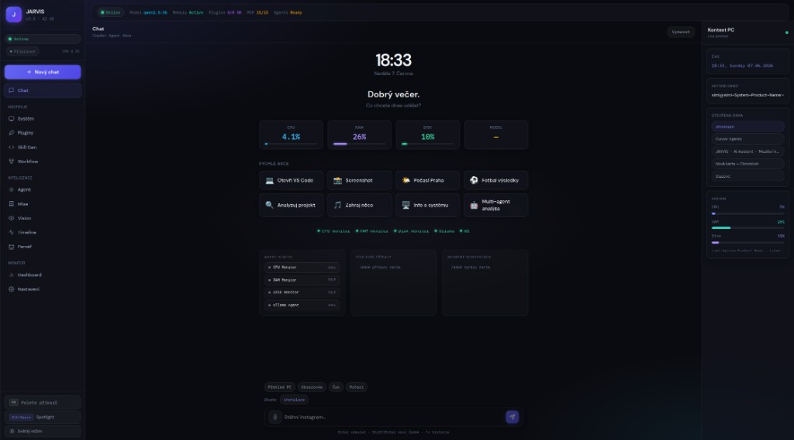
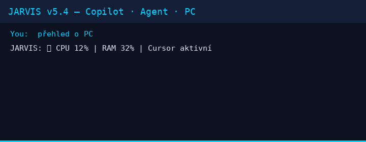

<div align="center">


# JARVIS

**Local AI assistant for Linux — chat, system commands, and optional autonomous control.**

> **Why JARVIS exists:** Your desktop already knows which window is active, what's eating RAM, and which apps are open — but cloud assistants don't. JARVIS runs on your machine, turns that live context into answers and actions, and keeps everyday commands on a sub-millisecond local router so you are not sending your screen to someone else's API.

<br/>

[](https://github.com/simivilasek-ship-it/Jarvis/actions/workflows/test.yml)
[](https://github.com/simivilasek-ship-it/Jarvis)
[](https://python.org)
[](#linux-out-of-the-box)
[](LICENSE)
[](https://github.com/simivilasek-ship-it/Jarvis)

</div>

---

## Quickstart

```bash
git clone https://github.com/simivilasek-ship-it/Jarvis.git && cd Jarvis && ./install.sh && python3 dashboard.py
```

Open **http://localhost:8002/app** — chat, live PC context, and Work Timeline work immediately.

```bash
python jarvis.py log --today          # CLI — co jsi dělal dnes
python jarvis.py log --markdown       # markdown report
systemctl --user enable jarvis.service  # autostart (po ./install.sh)
```

<details>
<summary><strong>Full setup (Ollama, API keys, Docker, restart)</strong></summary>

```bash
git clone https://github.com/simivilasek-ship-it/Jarvis.git
cd Jarvis && ./install.sh
python3 dashboard.py              # backend + UI → http://localhost:8002/app
python3 dashboard.py --restart    # kill old process on :8002, reload code
```

Alternativa s nativním oknem: `bash scripts/start.sh` · Makefile: `just start`

**Cloud speed (optional)** — free key at [console.groq.com](https://console.groq.com):
```bash
echo "GROQ_API_KEY=gsk_..." >> .env
```

**Local LLM (offline chat):**
```bash
curl -fsSL https://ollama.com/install.sh | sh
ollama pull qwen2.5:3b
```

**Docker:**
```bash
docker compose up -d    # http://localhost:8002/app — set JARVIS_API_TOKEN in .env
```

</details>

---

## Who is it for

| You are… | JARVIS gives you… |
|----------|-------------------|
| **Linux daily driver** | Czech/English chat, open apps, weather, hardware info — no ChatGPT tab, no copy-paste |
| **Developer on local-first** | Ollama + optional Groq, agent graph for multi-step tasks, MCP/plugins when you need them |
| **Power user tired of cloud context** | Live PC context (active window, CPU/RAM, open apps) injected into every reply |
| **Cautious about automation** | Computer use and UI clicks are **opt-in**; vision sandbox previews before execute |
| **Tinkerer** | Workflows, missions, GraphRAG memory, background workers — all on your disk |
| **Developer who forgets what they did** | **Work Timeline** — *"What did I do today?"*, git commits, build fails, time per project |

Not for you if you want a hosted SaaS with zero setup, or if you need polished Windows/macOS parity (Linux is primary).

---

## See it in action

<table>
  <tr>
    <td width="50%">
      <a href="docs/dashboard.jpg">
        
      </a>
      <br/><sub><b>Dashboard</b> — chat, rychlé akce, živý kontext PC</sub>
    </td>
    <td width="50%">
      <a href="docs/demo.gif">
        
      </a>
      <br/><sub><b>Agent flow</b> — multi-step task v reálném čase</sub>
    </td>
  </tr>
</table>

```
You:    "Open Chrome, research the best Python async libraries,
         summarize findings, and save a note."

JARVIS: Opening Chrome...                      ✓  0.3s
        Searching: best Python async libraries ✓  1.8s
        Reading top 5 results...               ✓  4.2s
        Summarizing with Groq LLaMA 3.3...     ✓  5.1s
        Saving note to ~/notes/async-libs.md   ✓  5.4s
        Done. Want me to read it aloud?
```

> 📹 YouTube demo — coming soon

---

## What else it does

- **Voice in web UI** — mic button / duplex stream (`/ws/audio`); Whisper STT when configured
- **Wake word** (“jarvis”) — desktop app only
- **Long-term memory** — GraphRAG knowledge graph (SQLite MVP)
- **Work Timeline + Memory** — tracks apps, git, Docker, builds; answers *"What did I do last week?"* (`/api/activity/query`)
- **Proactive AI** — CPU/RAM alerts, Docker RAM warnings, build-fail → GitHub issue suggestion
- **Agent Activity Feed** — live feed via `/ws/activity` (*18:31 Reading repository → 18:32 Running tests*)
- **Next.js UI** — jeden frontend v `web/` (Next.js 16); záložky **Dnes**, **Feed**, **Release**, **Agent mise**; Alt+W/F/C/M
- **Background workers** — email, git, Slack, GitHub, calendar — need `.env` tokens
- **Long-horizon missions** — autonomní mise + release checklisty v jedné SQLite DB (`mission_manager`)
- **E2E API tests in CI** — `pytest -m integration` (activity, missions, agent timeline)
- **Daily summary** — Alt+D nebo `jarvis log --today` / `GET /api/activity/report?format=md`
- **Systemd autostart** — `desktop/jarvis.service` (instaluje `install.sh`)
- **Desktop notifications** — proaktivní alerty přes `notify-send` (Linux)
- **Health Check panel** — Settings zobrazuje Ready Score + MCP readiness + fix hints
- **Install UX** — snap/flatpak progress in chat, cancel, structured errors
- **Onboarding wizard** — first run checks Ollama, snap, microphone
- **MCP guide** — [docs/mcp-servers.md](docs/mcp-servers.md) — které servery reálně fungují
- **100% local option** — Ollama + on-device Whisper; no cloud API key required

---

## Linux out of the box

> **Linux-first:** JARVIS is developed and tested primarily on Linux (Ubuntu/Debian). macOS and Windows support exists but is less complete.

After `./install.sh` and `python3 dashboard.py`, these work **without extra configuration**:

| Feature | Notes |
|---------|-------|
| **Czech chat** | Regex router + fallback replies; cloud LLM optional |
| **Local command router** | Open apps, weather, time, screenshots — &lt;1 ms, no LLM |
| **Hardware info** | CPU, RAM, disk, GPU via `/proc` and system tools |
| **Live PC context** | Active window, open apps, top processes — injected into chat |
| **Weather & time** | Built-in commands, no API key |
| **Snap app install** | `"install spotify"` etc. — requires `sudo` for `snap install` |

**Needs setup before it works:**

| Feature | Setup |
|---------|-------|
| **Local LLM chat (Ollama)** | Install [Ollama](https://ollama.com), pull a model (`ollama pull qwen2.5:3b`) |
| **Voice input (Whisper)** | Whisper model download on first use; mic permissions |
| **Background workers** | `.env` tokens for Slack, email (IMAP), GitHub, calendar |
| **Screen / UI automation** | Opt-in: `computer_use_enabled=true` in `config.json` (AT-SPI on Linux) |
| **LAN dashboard access** | `JARVIS_BIND_HOST=0.0.0.0` + `JARVIS_API_AUTH_REQUIRED=1` + token |

API binds to **`127.0.0.1` by default** — not exposed on your network unless you change it.

---

## 3 things that make it different

### 1 · Optional PC automation (opt-in)

With **`computer_use_enabled`** and vision sandbox, JARVIS can preview and execute UI actions — OCR first, vision model fallback. This is **disabled by default**; enable only when you need it.

```python
# Requires computer_use_enabled + vision sandbox approval
agent.run_task("Open Firefox and search for Python async libraries")
# → navigates visible UI when AT-SPI / vision pipeline is configured
```

Works best on Linux with AT-SPI; quality varies by app and desktop environment. Not a guarantee of control in every application.

---

### 2 · Agent Graph Orchestration

Not a single LLM call. A full pipeline: **Plan → Route → Execute → Critique → Repeat**.

```
PLANNER   breaks the task into ordered steps
    │
ROUTER    picks the right tool for each step
    │
EXECUTOR  runs the tool, captures output
    │
CRITIC    validates result — retry, replan, or done
```

If a step fails, the agent backs up and tries a different path. Self-correcting. Visible in real-time in the dashboard.

---

### 3 · Plugin + MCP Ecosystem

External tools integrate via plugins and [Model Context Protocol](https://modelcontextprotocol.io/). Install from the marketplace when available; many require API keys in `.env`.

```bash
"install plugin brave-search"    # needs BRAVE_API_KEY
"install plugin slack-notifier"  # needs SLACK_BOT_TOKEN
```

Several MCP servers ship with the repo (filesystem, git, fetch, …). Availability depends on your OS and configured tokens — not every plugin works on every platform.

---

## Copilot · Agent · PC Manager

One chat, three automatic modes:

| Mode | When | Examples |
|------|------|----------|
| **Copilot** | Conversation, code, explanations | *"Explain asyncio"*, *"What am I working on?"* |
| **Action** | OS commands (regex router, &lt;1 ms) | *"Open Firefox"*, *"Screenshot"*, *"Weather in Prague"*, *"What time is it?"* |
| **Agent** | Multi-step tasks (needs LLM) | *"Find X and save a note"*, *"Check repo and summarize"* |

JARVIS injects **live PC context** — active window, open apps, CPU/RAM/disk — into Copilot replies when available.

```bash
"PC overview"          # system snapshot + windows + top processes
"What's on my screen?" # factual window list
"install vlc"          # snap install (sudo)
```

---

## Performance

| What | How fast |
|------|----------|
| OS command (`open Firefox`) | **< 1 ms** — regex, no LLM |
| Chat response (Ollama, warm) | **~120 ms+** — depends on model/GPU |
| Chat response (Groq cloud) | **~200 ms** — LLaMA 3.3 70B |
| Voice transcription (Whisper) | **~200 ms+** — first run downloads model |
| Screen click via OCR | **~50 ms** — when vision pipeline enabled |

RAM: **~34 MB** idle backend · **~650 MB+** with Ollama loaded · runs on any modern laptop.

---

## Architecture

```
activity_*.py  Work Timeline — collector, store, bridge
src/api/       FastAPI · WebSocket · LAN auth · activity routes
routing.py     Local router (<1 ms) + agent pipeline
memory.py      Neural memory + GraphRAG + daily summarizer
mission_*.py   Agent missions + release checklists (SQLite)
web/           Next.js 16 — Chat, Dnes, Feed, Checklist (Alt+W/F/C/D)
```

Backend: **FastAPI** (`src/api/`) · Frontend: **Next.js** · CLI: **`jarvis log`**

**Web dashboard (v5.12):** Work Timeline, Activity Feed, daily summary (Alt+D), proactive AI + desktop notify, unified runtime, onboarding, install UX, missions + checklist, live PC context, voice in chat.

→ **[docs/index.md](docs/index.md)** · **[docs/mcp-servers.md](docs/mcp-servers.md)** · **[docs/CANONICAL.md](docs/CANONICAL.md)** · **[docs/api-reference.md](docs/api-reference.md)** · **[web/README.md](web/README.md)**

> **Legacy:** `gui/` (Tkinter) je deprecated — produkční UI je Next.js na `/app`.

---

## Security

- API listens on **`127.0.0.1` by default** — override with `JARVIS_BIND_HOST` only if you need LAN access
- When binding to `0.0.0.0`, set **`JARVIS_API_AUTH_REQUIRED=1`** and a strong `JARVIS_API_TOKEN`
- Shell commands go through a **blacklist** (`rm -rf /`, `dd`, reverse shells, fork bombs — always blocked)
- Agent actions require **permission levels** — destructive ops need user confirmation
- **Web UI confirmation modal** — when the browser is connected, ELEVATED actions wait for approve/deny (`/ws/confirm`)
- Every action is **audit-logged** to `~/.jarvis_audit.jsonl`
- Headless/CI without web client blocks `ELEVATED` by default (opt-in: `JARVIS_HEADLESS_APPROVE_ELEVATED=1`)
- **Docker:** `docker-compose.yml` enables API auth by default — set `JARVIS_API_TOKEN` in `.env`

---

## Tests · Docs · Contributing

```bash
pytest tests/ test_jarvis.py -v   # 699 tests (615 unit + 84 integration)
python scripts/check_utf8.py      # UTF-8 gate (CI)
```

[API Reference](docs/api-reference.md) · [MCP Servers](docs/mcp-servers.md) · [Configuration](docs/configuration.md) · [Plugin Dev](docs/plugin-development.md) · [CHANGELOG](CHANGELOG.md)

---

<div align="center">

MIT © 2026 · [simivilasek-ship-it](https://github.com/simivilasek-ship-it)

*Your computer. Your data. Your OS.*

</div>
